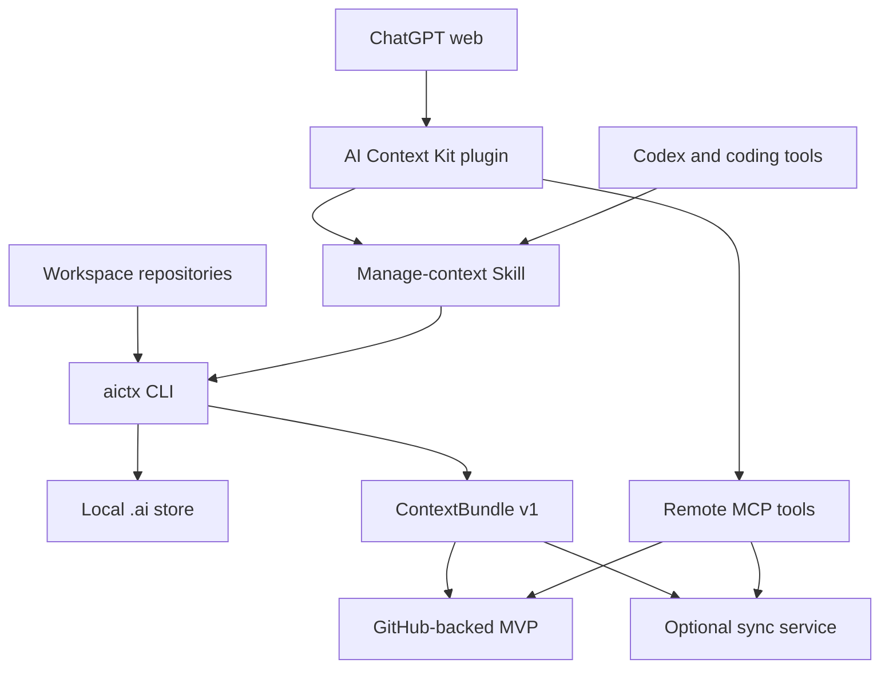

# Plugin architecture and web roadmap

AI Context Kit is evolving from a local CLI with a bundled Skill into a plugin-backed context system that can serve both coding agents and ChatGPT. The local repository remains the source of truth. Plugin packaging improves discovery and workflow guidance; it does not by itself make local files reachable from a web session.

## Product boundary

The product has three independent responsibilities:

| Component | Responsibility | Trust boundary |
|---|---|---|
| `aictx` CLI | Discover local projects, render bounded observations, maintain fingerprints, and export context bundles | Local machine and workspace |
| Plugin Skill | Teach supported agents when and how to initialize, load, refresh, validate, and compact context | Installed agent runtime |
| MCP service | Expose explicitly synchronized context to ChatGPT and other remote clients | Remote service and authenticated account |

Repository files and explicit project rules always outrank generated context. A freshness label covers only the inputs recorded in the observation scope.

## Target architecture

The repository implements the local CLI, portable plugin manifest, publication format, and read-only MCP server. A root `mcp.json` is intentionally withheld until a real stable HTTPS deployment URL exists; `mcp.example.json` documents the final mapping without pretending that hosting is already active.

## Delivery stages

### Stage 1: standard plugin package

The repository provides `.codex-plugin/plugin.json` and exposes the canonical Skill from `skills/manage-ai-context`. The existing Python package continues to ship the same Skill and the `aictx` command remains responsible for deterministic local work.

Success criteria:

- the plugin manifest passes schema validation;
- the Skill has one canonical source location;
- Python wheels contain that canonical Skill;
- existing CLI tests and builds remain green;
- documentation does not claim that web sessions can access local files.

### Stage 2: GitHub-backed web MVP (source complete; deployment required)

The CLI exports a deliberately bounded and reviewable `ContextBundle v1`. A user explicitly publishes selected bundles to a GitHub repository or branch. A plugin dependency or thin MCP server retrieves those bundles for ChatGPT.

Recommended read-only tools:

| Tool | Result |
|---|---|
| `list_projects` | Projects with bundle version and update time |
| `get_context` | The selected project's shared, automatic, and manual context |
| `get_freshness` | Export-time freshness and observation scope |

Writes stay out of the first web MVP. `aictx publish github` creates a reviewable local directory and performs no GitHub mutation. The MCP server reads only the configured repository, index, and declared project bundle paths. See [the deployment guide](github-web-mvp.md).

### Stage 3: optional remote synchronization

Only after the GitHub-backed workflow demonstrates demand, add an authenticated service and remote MCP server. Possible operations include `aictx login`, `aictx push`, project-level access controls, encrypted storage, version history, and explicit write-back of manual memory.

This stage must preserve:

- opt-in synchronization per project;
- least-privilege access;
- visible bundle provenance and version;
- deletion and export controls;
- no claim of real-time freshness without a successful sync;
- no implicit access to ChatGPT saved memory.

## Current capability matrix

| Capability | Status |
|---|---|
| Install and run the local CLI | Available |
| Invoke the bundled manage-context Skill | Available after plugin/Skill installation |
| Generate adapters for Codex, Claude, Gemini, and Cursor | Available |
| Export a ChatGPT Project handoff | Available; upload remains manual |
| Export `ContextBundle v1` for a harness | Available |
| Read local `.ai/` files directly from ChatGPT web | Not available |
| Prepare reviewable GitHub publication tree | Available |
| Run read-only GitHub-backed MCP locally or in a container | Available |
| Retrieve context from ChatGPT through MCP | Requires a user-provided stable HTTPS deployment and ChatGPT registration |
| Synchronize ChatGPT saved memory | Out of scope |

## Why this split

Keeping collection local makes observation deterministic and auditable. Keeping the Skill thin avoids duplicating CLI behavior in prompts. Adding remote access only behind an explicit exported bundle gives web clients useful context without turning AI Context Kit into an unrestricted source-code crawler or prematurely operating a multi-tenant storage service.
